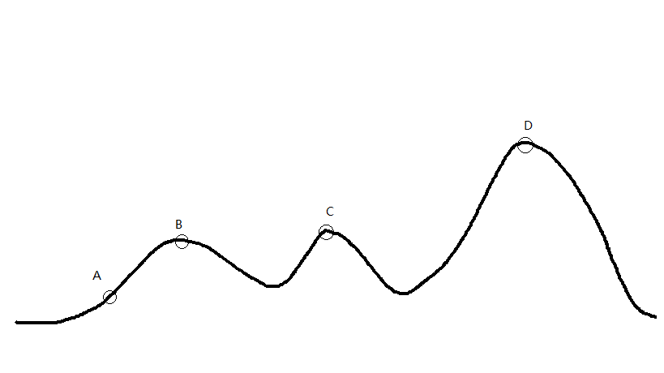

# 学习模拟退火算法的原理及简单应用

在学习数学建模的过程中，模拟退火算法是一类比较好的优化算法，因此经过初步学习之后，在这里对模拟退火算法进行一个简单的算法思想介绍和应用。

## 爬山算法简介（Hill Climbing）
由于模拟退火算法与爬山算法有一定的相似性，所以在学习模拟退火算法之前，我首先对爬山算法进行了一定的了解。
  
爬山算法是一种简单的贪心搜索算法，这个算法每次从当前解的临近解空间中选择一个最优解作为当前解，直到找到一个局部最优解。而其有一个主要的缺陷，即该算法会陷入因搜索到局部最优解，而无法搜索到全局最优解的困境。
  
如图所示


假设A为当前解，爬山算法搜索到B这个局部最优解就将结束，因为在B点无论向哪个方向小范围地移动，都不会得到更优解，从而搜索不到全局最优解D。
  
## 模拟退火算法（SA,Simulated Annealing）
### 算法思想
模拟退火算法是一种智能优化算法，它其实也是一种贪心算法。只不过该算法的搜索过程引入了随机因素。模拟退火算法以一定的概率来接受一个比当前解要差的解，因此有可能会跳出这个局部的最优解，达到全局的最优解。以上图为例，模拟退火算法在搜索到局部最优解B后，会以一定的概率接受向右继续移动。也许经过几次这样的不是局部最优的移动后会到达D点或D点，于是就跳出了局部最小值B，使其有可能达到全局最优解D。

#### 模拟退火算法描述：
若 **J(Y(i+1)) >= J(Y(i))** (即移动后得到更优解)，则总是接受该移动。
若 **J(Y(i+1)) < J(Y(i))** (即移动后的解比当前解要差)，则以一定的概率来决定是否接受移动，并且这个概率随着时间推移逐渐降低（逐渐降低才能趋向稳定）

这里的“一定的概率”的计算参考了金属冶炼的退火过程，这也是模拟退火算法名称的由来。

根据热力学的原理，在温度为*T*时，出现能量差为*dE*的降温的概率为*P(dE)* ，表示为：

    P(dE) = exp( dE/(kT) )
    
其中*k*是一个常数，*exp*表示自然指数，且dE<0。这条公式说白了就是：**温度越高，出现一次能量差为dE的降温的概率就越大；温度越低，则出现降温的概率就越小**。又由于dE总是小于0（否则就不叫退火了），因此dE/kT < 0 ，所以P(dE)的函数取值范围是(0,1) 。随着温度T的降低，P(dE)会逐渐降低。

我们将一次向较差解的移动看做一次温度跳变过程，我们以概率P(dE)来接受这样的移动。

关于普通贪心算法与模拟退火算法，有这样一个有趣的比喻：

* 普通贪心算法：兔子朝着比现在低的地方跳去。它找到了不远处的最低的山谷。但是这座山谷不一定最低的。这就是普通贪心算法，它不能保证局部最优值就是全局最优值。
* 模拟退火算法：兔子喝醉了。它随机地跳了很长时间。这期间，它可能走向低处，也可能踏入平地。但是，它渐渐清醒了并朝最低的方向跳去。这就是模拟退火。

### 算法伪代码
```/*
* J(y)：在状态y时的评价函数值
* Y(i)：表示当前状态
* Y(i+1)：表示下一个状态
* r： 用于控制降温的快慢
* T： 系统的温度，系统初始应该要处于一个高温的状态
* T_min ：温度的下限，若温度T达到T_min，则停止搜索
*/
while( T > T_min )
{
　　dE = J( Y(i+1) ) - J( Y(i) ) ; 
　　if ( dE >=0 ) //说明移动后得到更优解，则总是接受移动
Y(i+1) = Y(i) ; //接受从Y(i)到Y(i+1)的移动
　　else
　　{
// 函数exp( dE/T )的取值范围是(0,1) ，dE/T越大，则exp( dE/T )也越大
if ( exp( dE/T ) > random( 0 , 1 ) )
Y(i+1) = Y(i) ; //接受从Y(i)到Y(i+1)的移动
　　}
　　T = r * T ; //降温退火 ，0<r<1 。r越大，降温越慢；r越小，降温越快
　　/*
　　* 若r过大，则搜索到全局最优解的可能会较高，但搜索的过程也就较长。若r过小，则搜索的过程会很快，但最终可能会达到一个局部最优值
　　*/
　　i ++ ;
}
```

### 旅行商问题（TSP）
有若干个城市，任何两个城市之间的距离都是确定的，现要求一旅行商从某城市出发必须经过每一个城市且只在一个城市逗留一次，最后回到出发的城市，问如何事先确定一条最短的线路已保证其旅行的费用最少？

现利用一个现成的城市信息，并给出其利用模拟退火算法的C代码：
```/*
 * 使用模拟退火算法(SA)求解TSP问题(以中国TSP问题为例)
 * 参考自《Matlab 智能算法30个案例分析》
 * 模拟退火的原理这里略去，可以参考上书或者相关论文
 * update: 16/12/11
 * author:lyrichu
 * email:919987476@qq.com
 */
#include<stdio.h>
#include<stdlib.h>
#include<string.h>
#include<time.h>
#include<math.h>
#define T0 50000.0  // 初始温度
#define T_end (1e-8)
#define q  0.98   // 退火系数
#define L 1000  // 每个温度时的迭代次数，即链长
#define N 31  // 城市数量
int city_list[N]; // 用于存放一个解
double city_pos[N][2] = {{1304,2312},{3639,1315},{4177,2244},{3712,1399},{3488,1535},{3326,1556},{3238,1229},{4196,1004},{4312,790},
    {4386,570},{3007,1970},{2562,1756},{2788,1491},{2381,1676},{1332,695},{3715,1678},{3918,2179},{4061,2370},{3780,2212},{3676,2578},{4029,2838},
    {4263,2931},{3429,1908},{3507,2367},{3394,2643},{3439,3201},{2935,3240},{3140,3550},{2545,2357},{2778,2826},{2370,2975}}; // 中国31个城市坐标
//函数声明
double distance(double *,double *); // 计算两个城市距离
double path_len(int *);  // 计算路径长度
void  init();  //初始化函数
void create_new(); // 产生新解
// 距离函数
double distance(double * city1,double * city2)
{
    double x1 = *city1;
    double y1 = *(city1+1);
    double x2 = *(city2);
    double y2 = *(city2+1);
    double dis = sqrt((x1-x2)*(x1-x2)+(y1-y2)*(y1-y2));
    return dis;
}

// 计算路径长度
double path_len(int * arr)
{
    double path = 0; // 初始化路径长度
    int index = *arr; // 定位到第一个数字(城市序号)
    for(int i=0;i<N-1;i++)
    {
        int index1 = *(arr+i);
        int index2 = *(arr+i+1);
        double dis = distance(city_pos[index1-1],city_pos[index2-1]);
        path += dis;
    }
    int last_index = *(arr+N-1); // 最后一个城市序号
    int first_index = *arr; // 第一个城市序号
    double last_dis = distance(city_pos[last_index-1],city_pos[first_index-1]);
    path = path + last_dis;
    return path; // 返回总的路径长度
}

// 初始化函数
void init()
{
    for(int i=0;i<N;i++)
        city_list[i] = i+1;  // 初始化一个解
}

// 产生一个新解
// 此处采用随机交叉两个位置的方式产生新的解
void create_new()
{
    double r1 = ((double)rand())/(RAND_MAX+1.0);
    double r2 = ((double)rand())/(RAND_MAX+1.0);
    int pos1 = (int)(N*r1); //第一个交叉点的位置
    int pos2 = (int)(N*r2);
    int temp = city_list[pos1];
    city_list[pos1] = city_list[pos2];
    city_list[pos2] = temp;   // 交换两个点
}

// 主函数
int main(void)
{
    srand((unsigned)time(NULL)); //初始化随机数种子
    time_t start,finish;
    start = clock(); // 程序运行开始计时
    double T;
    int count = 0; // 记录降温次数
    T = T0; //初始温度
    init(); //初始化一个解
    int city_list_copy[N]; // 用于保存原始解
    double f1,f2,df; //f1为初始解目标函数值，f2为新解目标函数值，df为二者差值
    double r; // 0-1之间的随机数，用来决定是否接受新解
    while(T > T_end) // 当温度低于结束温度时，退火结束
    {
        for(int i=0;i<L;i++)
        {
            memcpy(city_list_copy,city_list,N*sizeof(int)); // 复制数组
            create_new(); // 产生新解
            f1 = path_len(city_list_copy);
            f2 = path_len(city_list);
            df = f2 - f1;
            // 以下是Metropolis准则
            if(df >= 0)
            {
                r = ((double)rand())/(RAND_MAX);
                if(exp(-df/T) <= r) // 保留原来的解
                {
                    memcpy(city_list,city_list_copy,N*sizeof(int));
                }
            }
        }
        T *= q; // 降温
        count++;
    }
    finish = clock(); // 退火过程结束
    double duration = ((double)(finish-start))/CLOCKS_PER_SEC; // 计算时间
    printf("采用模拟退火算法，初始温度T0=%.2f,降温系数q=%.2f,每个温度迭代%d次,共降温%d次，得到的TSP最优路径为:\n",T0,q,L,count);
    for(int i=0;i<N-1;i++)  // 输出最优路径
    {
        printf("%d--->",city_list[i]);
    }
    printf("%d\n",city_list[N-1]);
    double len = path_len(city_list); // 最优路径长度
    printf("最优路径长度为:%lf\n",len);
    printf("程序运行耗时:%lf秒.\n",duration);
    return 0;
}
```

### 算法比较和优缺点
模拟退火算法为求解传统方法难以处理的TSP问题提供了一个有效的途径和通用的处理框架，并逐渐发展成为一种迭代自适应启发式概率搜索算法。模拟退火算法可以用于求解不同的非线性问题，对于不可微甚至不连续函数的优化，能以较大概率求得全局最优解，该算法还具有较强的鲁棒性、全局收敛性、隐含并行性以及广泛的适应性，对目标函数以及约束函数没有任何要求。

由于TSP的典型性，在过去的几十年中对于TSP问题出现了很多种解法：

* 模拟退火算法（SA）
* 禁忌搜索算法（TS）
* Hopfield神经网络优化算法 
* 蚁群算法 
* 遗传算法（GA）
* 混合优化策略

SA，GA和TS作为具有全局优化性能的典型Meta-heuristic算法代表，与人工神经网络统称为四大现代启发式算法。蚁群算法是90年代初才被提出的全新的算法，而混合优化策略由于缺乏严格且丰富的理论研究和效率分析也是近年来也才得到发展和应用。概括地讲，SA算法的实验性能具有质量高、初值鲁棒性强、通用易实现的优点，最大缺点是往往优化过程较长。

本篇文档作为学习文档，借鉴了一些博客上的论述，并搜集相关材料进行整合。
参考：

https://www.cnblogs.com/lyrichu/p/6688459.html

https://wenku.baidu.com/view/6c9849eba98271fe900ef913.html
