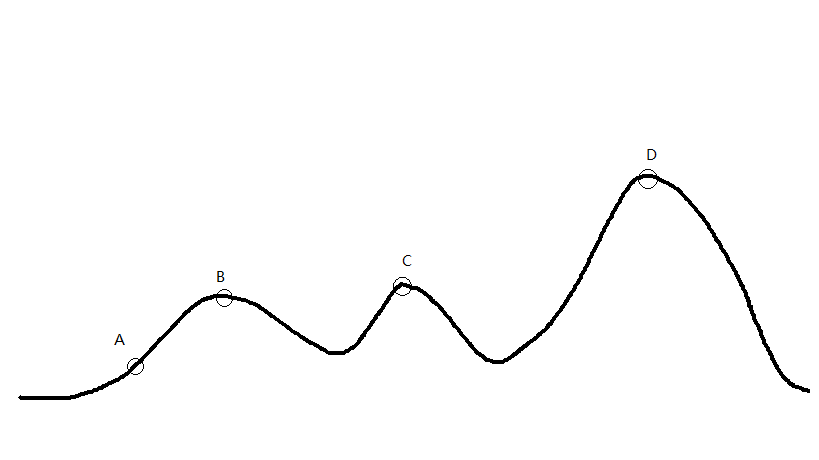

# 学习模拟退火算法的原理及简单应用

在学习数学建模的过程中，模拟退火算法是一类比较好的优化算法，因此经过初步学习之后，在这里对模拟退火算法进行一个简单的算法思想介绍和应用。

## 爬山算法简介（Hill Climbing）
由于模拟退火算法与爬山算法有一定的相似性，所以在学习模拟退火算法之前，我首先对爬山算法进行了一定的了解。
  
爬山算法是一种简单的贪心搜索算法，这个算法每次从当前解的临近解空间中选择一个最优解作为当前解，直到找到一个局部最优解。而其有一个主要的缺陷，即该算法会陷入因搜索到局部最优解，而无法搜索到全局最优解的困境。
  
如图所示

  
假设A为当前解，爬山算法搜索到B这个局部最优解就将结束，因为在B点无论向哪个方向小范围地移动，都不会得到更优解，从而搜索不到全局最优解D。
  
## 模拟退火算法（SA,Simulated Annealing）
### 算法思想
模拟退火算法是一种智能优化算法，它其实也是一种贪心算法。只不过该算法的搜索过程引入了随机因素。模拟退火算法以一定的概率来接受一个比当前解要差的解，因此有可能会跳出这个局部的最优解，达到全局的最优解。以上图为例，模拟退火算法在搜索到局部最优解B后，会以一定的概率接受向右继续移动。也许经过几次这样的不是局部最优的移动后会到达D点或D点，于是就跳出了局部最小值B，使其有可能达到全局最优解D。

#### 模拟退火算法描述：
若 **J(Y(i+1)) >= J(Y(i))** (即移动后得到更优解)，则总是接受该移动。
若 **J(Y(i+1)) < J(Y(i))** (即移动后的解比当前解要差)，则以一定的概率来决定是否接受移动，并且这个概率随着时间推移逐渐降低（逐渐降低才能趋向稳定）

这里的“一定的概率”的计算参考了金属冶炼的退火过程，这也是模拟退火算法名称的由来。

根据热力学的原理，在温度为*T*时，出现能量差为*dE*的降温的概率为*P(dE)* ，表示为：

    P(dE) = exp( dE/(kT) )
    
其中*k*是一个常数，*exp*表示自然指数，且dE<0。这条公式说白了就是：**温度越高，出现一次能量差为dE的降温的概率就越大；温度越低，则出现降温的概率就越小**。又由于dE总是小于0（否则就不叫退火了），因此dE/kT < 0 ，所以P(dE)的函数取值范围是(0,1) 。随着温度T的降低，P(dE)会逐渐降低。

我们将一次向较差解的移动看做一次温度跳变过程，我们以概率P(dE)来接受这样的移动。

关于普通贪心算法与模拟退火算法，有这样一个有趣的比喻：

* 普通贪心算法：兔子朝着比现在低的地方跳去。它找到了不远处的最低的山谷。但是这座山谷不一定最低的。这就是普通贪心算法，它不能保证局部最优值就是全局最优值。
* 模拟退火算法：兔子喝醉了。它随机地跳了很长时间。这期间，它可能走向低处，也可能踏入平地。但是，它渐渐清醒了并朝最低的方向跳去。这就是模拟退火。

### 算法伪代码
···/*
* J(y)：在状态y时的评价函数值
* Y(i)：表示当前状态
* Y(i+1)：表示新的状态
* r： 用于控制降温的快慢
* T： 系统的温度，系统初始应该要处于一个高温的状态
* T_min ：温度的下限，若温度T达到T_min，则停止搜索
*/
while( T > T_min )
{
　　dE = J( Y(i+1) ) - J( Y(i) ) ; 
　　if ( dE >=0 ) //表达移动后得到更优解，则总是接受移动
Y(i+1) = Y(i) ; //接受从Y(i)到Y(i+1)的移动
　　else
　　{
// 函数exp( dE/T )的取值范围是(0,1) ，dE/T越大，则exp( dE/T )也
if ( exp( dE/T ) > random( 0 , 1 ) )
Y(i+1) = Y(i) ; //接受从Y(i)到Y(i+1)的移动
　　}
　　T = r * T ; //降温退火 ，0<r<1 。r越大，降温越慢；r越小，降温越快
　　/*
　　* 若r过大，则搜索到全局最优解的可能会较高，但搜索的过程也就较长。若r过小，则搜索的过程会很快，但最终可能会达到一个局部最优值
　　*/
　　i ++ ;
}···

